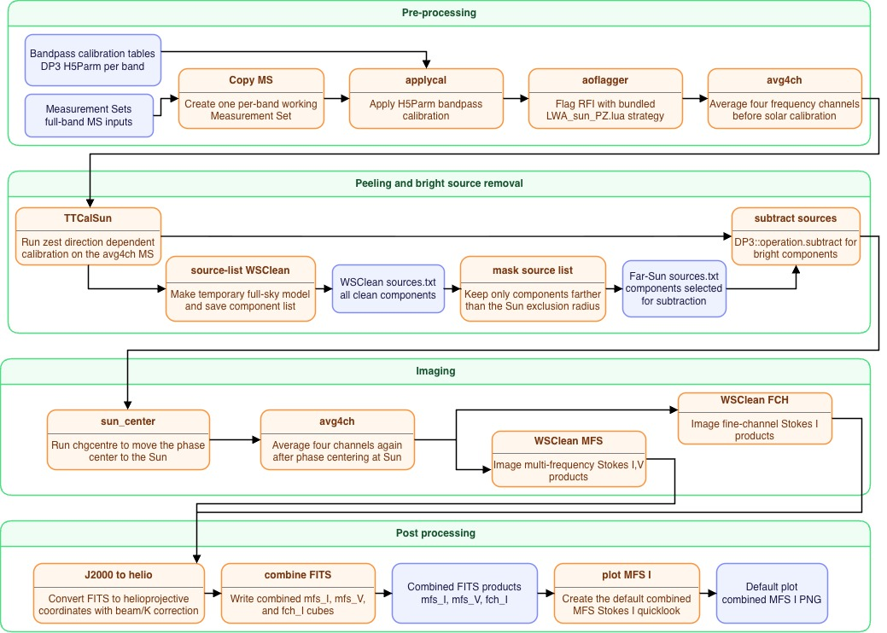

# lwasolarproc

`lwasolarproc` contains OVRO-LWA solar preprocessing, WSClean imaging, FITS/HDF5 utilities, and visualization helpers.

This repository uses a standard package layout:

```text
lwasolarproc/
  pyproject.toml
  README.MD
  lwasolarproc/
    __init__.py
    coords.py
    source_list.py
    preprocessing_and_imaging.py
    visualization.py
    wsclean_helper.py
```

The package is intended to be installed from this directory:

```bash
cd /fast/rtpipe/lwasolarproc
source /fast/rtpipe/use_lwa.sh
uv pip install --python /fast/rtpipe/env/lwa/bin/python -e . --no-build-isolation
```

If the environment does not already have build tooling, install it first:

```bash
uv pip install --python /fast/rtpipe/env/lwa/bin/python setuptools wheel
```

## Runtime Setup

Use the LWA environment before running package commands:

```bash
source /fast/rtpipe/use_lwa.sh
```

That script activates `/fast/rtpipe/env/lwa`, configures cache directories, and sets a writable SunPy working directory so `sunpy.map` does not try to write under the home directory.

The visualization module uses `sunpy.map` directly. The environment needs SunPy's map extras, including `reproject` and `mpl-animators`.

## Command Line

The package installs a full-band preprocessing and imaging entry point:

```bash
lwasolarproc-fullband --help
```

The command wraps the full-band workflow:

1. copy or reuse Measurement Sets
2. apply H5Parm calibration with DP3
3. run AOFlagger with the bundled `LWA_sun_PZ.lua`
4. average by 4 channels
5. run TTCalSun
6. build a WSClean source list and subtract bright sources farther than the Sun exclusion radius
7. recenter on the Sun
8. average by 4 channels again
9. image MFS Stokes I/V and fine-channel Stokes I with WSClean
10. convert J2000 FITS products to helioprojective coordinates with beam/K correction
11. combine FITS products and write the default MFS Stokes I quicklook plot

## Pipeline Workflow



Example dry run:

```bash
lwasolarproc-fullband \
  --ms-dir /fast/rtpipe/MS \
  --caltable-dir /fast/rtpipe/caltab_h5 \
  --work-dir /tmp/lwasolarproc_fullband \
  --dry-run
```

Bright source removal is enabled by default. It runs a temporary full-sky WSClean pass with `-save-source-list`, writes the all-source list, keeps only components farther than `--bright-source-min-distance-deg` from the Sun, and subtracts those components from the post-TTCalSun averaged MS with DP3 `predict.operation=subtract`. The temporary full-sky FITS/model products are deleted by default; use `--keep-bright-source-images` if you need to inspect them.

Useful source-removal options:

```bash
lwasolarproc-fullband \
  --ms-dir /fast/rtpipe/MS \
  --caltable-dir /fast/rtpipe/caltab_h5parm \
  --work-dir /fast/rtpipe/tests/_lwasolarproc_fullband \
  --bright-source-min-distance-deg 6 \
  --bright-source-image-size 4096 \
  --bright-source-scale 2arcmin
```

Use `--no-bright-source-removal` to run the older path without source-list subtraction.

Current default WSClean imaging settings use `-quiet`, `-j 18`, `-mem 8`, `-size 384 384`, `-scale 1.5arcmin`, `-weight briggs -0.5`, `-minuv-l 10`, `-auto-threshold 3`, `-niter 10000`, `-mgain 0.8`, `-beam-fitting-size 2`, `-no-reorder`, `-no-update-model-required`, and `-no-dirty`.

The 2026-04-19 bright-source fullband benchmark at `/fast/rtpipe/tests/_lwasolarproc_fullband_bright_source_20260419` completed `13/13` bands in `66.97 s` wall time. The per-band average was `56.81 s`, including `21.76 s` for bright source removal, and produced combined MFS I, MFS V, and fine-channel I FITS files plus the default MFS I plot.

## Python API

FITS/HDF5 round trip:

```python
from lwasolarproc import (
    compress_fits_to_h5,
    recover_fits_from_h5,
    check_h5_fits_consistency,
)

h5_path = compress_fits_to_h5("image.fits", "image.hdf")
recover_fits_from_h5(h5_path, fits_out="image.recovered.fits")
assert check_h5_fits_consistency("image.fits", h5_path) == 0
```

Visualization:

```python
import matplotlib
matplotlib.use("Agg")
from lwasolarproc.visualization import slow_pipeline_default_plot

fig, axes = slow_pipeline_default_plot("image_I.fits", add_logo=False)
fig.savefig("image_I.quicklook.png", dpi=150, bbox_inches="tight")
```

Full-band processing from Python:

```python
from pathlib import Path
from lwasolarproc import PipelineConfig, process_fullband

results = process_fullband(
    Path("/fast/rtpipe/MS"),
    [Path("/fast/rtpipe/caltab_h5/example.h5parm")],
    PipelineConfig(work_dir=Path("/tmp/lwasolarproc_fullband")),
)
```

## Package Data

The package bundles reusable processing resources:

- `LWA_sun_PZ.lua`
- `settings_mat_file/*.mat`

Use resource helpers instead of hard-coded checkout paths:

```python
from lwasolarproc import aoflagger_strategy_path, settings_file_path

strategy = aoflagger_strategy_path()
settings = settings_file_path("20251120a-settingsAll-day-FW7p5.mat")
```
